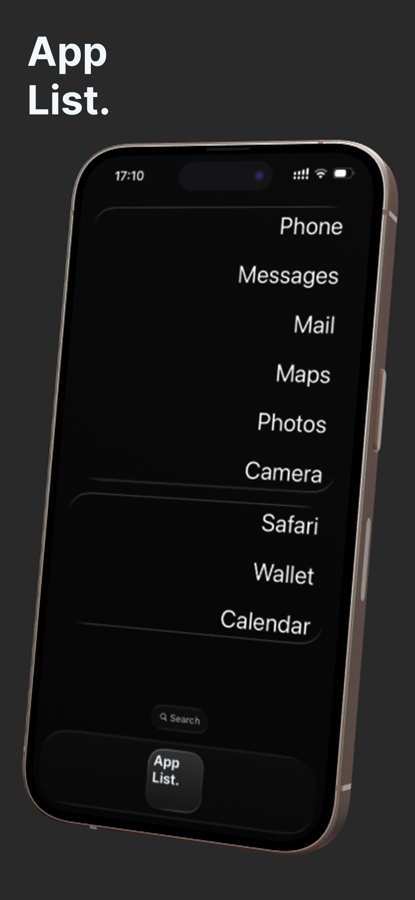

# AppList Catalog.

This repository is an open-source collection of popular iOS apps with known Universal Links & URL Schemes.

The list is directly used by AppList, a FREE minimalist app launcher for iPhone:
- https://getapplist.app

# Contributing

Contributions are welcome! 

Requirements:
1. Valid App Name
2. Valid Universal Link (preferred) or URL Scheme 
3. Your URL must open the app in a default state (i.e. not start some unexpected action like initiate a call with someone)

Nice to have (but accelerate the approval):
4. Video recording showing that your URL works

Once approved and merged, all you will need to do is restart your app for it to pick up the latest version.

# Special Cases

Below is a *non-exhaustive* list of apps purposedly not included in the official list:

**Facetime**:
- Reason: Require an argument & automatically start a call
- URL Scheme: `facetime://[phone-or-email]`

# License

MIT License.

